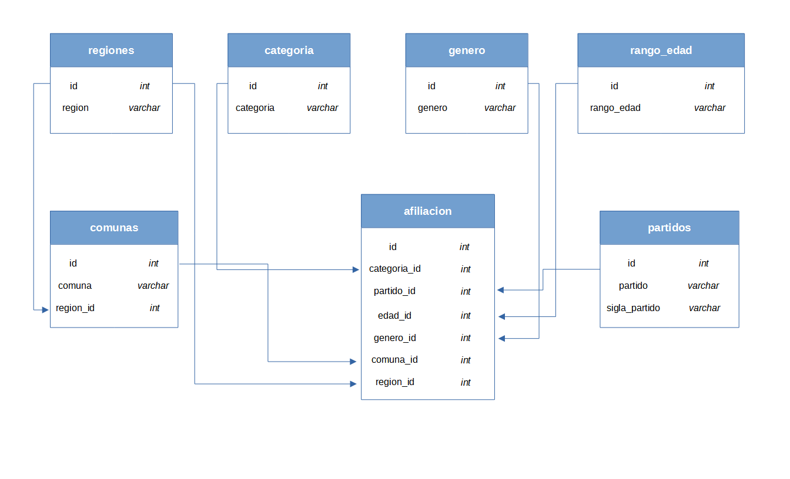

# Normalizando una base de datos.

La idea de este repositorio fue, en primer lugar, aplicar la idea central de normalizar una base de datos, que es reducir lo más posible la redundancia de información para mejorar su gestión, y luego usarla para practicar un poco en PostgreSQL.

La base de datos que utilizo contiene información descriptiva sobre el proceso de ratificación de militancia y de nuevos afiliados en partidos políticos de Chile, la que es construida y publicada por el Servicio Electoral (SERVEL). Ésta corresponde a la actualización del 31 de agosto de 2021 y puede ser descargada [acá](https://www.servel.cl/wp-content/uploads/2021/09/partidos20210831.csv). Más detalles sobre estas estadísticas pueden encontrarse en el [siguiente enlace](https://www.servel.cl/estadisticas-de-partidos-politicos/).

El conjunto de datos original luce como se ve en la siguiente muestra de cinco filas:

```
Categoría Cedula Comuna        FECHA_RESP Partido            Rango edad Region Domicilio Región      Sexo     DV
--------- ------ ------        ---------- -------            ---------- ---------------- ------      ----     --
Nuevo     0      Alto Hospicio 08312021   EVOLUCION POLITICA 20-24 años De Tarapaca      De Tarapaca Femenino 0
Nuevo     0      Iquique       08312021   IGUALDAD           20-24 años De Tarapaca      De Tarapaca Femenino 0
Nuevo     0      Iquique       08312021   IGUALDAD           20-24 años De Tarapaca      De Tarapaca Femenino 0
Nuevo     0      Alto Hospicio 08312021   NUEVO TIEMPO       20-24 años De Tarapaca      De Tarapaca Femenino 0
Nuevo     0      Alto Hospicio 08312021   NUEVO TIEMPO       20-24 años De Tarapaca      De Tarapaca Femenino 0
```

Para trabajar con esta base de datos, lo primero que hice fue quitar las columnas `Cedula`, `FECHA_RESP`, `DV` y `Region Domicilio`. Las tres primeras no entregan información relevante y la última la saqué porque mi idea es solo practicar, así que consideré que solo bastaba con el atributo `Región`.

En cuanto a las columnas restantes de la base de datos, todas contienen información redundante, así que a partir de ellas cree las siguientes tablas:

- `categoria`.
- `genero`.
- `comunas`.
- `regiones`.
- `rango_edad`.
- `partidos`.
- `afiliacion`.

La relación de estas tablas se observa en el diagrama de a continuación.



Usando el lenguaje de programación R limpié un poco la base de datos y luego cree las tablas mencionadas arriba, las que exporté como archivos `.csv` a la carpeta [tablas](./tablas/). Los scripts de este proceso están en el directorio [datos](./datos/).

Finalmente, en PostgreSQL cree una base de datos llamada `afiliacion_db` y en ella almacené las tablas, las que llené importando los archivos que están en [tablas](./tablas/). El script de dicho proceso y aquel donde practico un poco realizando algunas consultas están en la carpeta [`scripts`](./scripts/).

